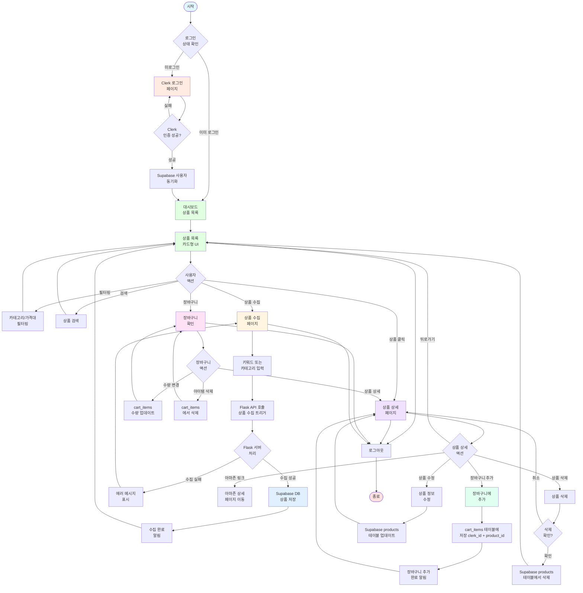
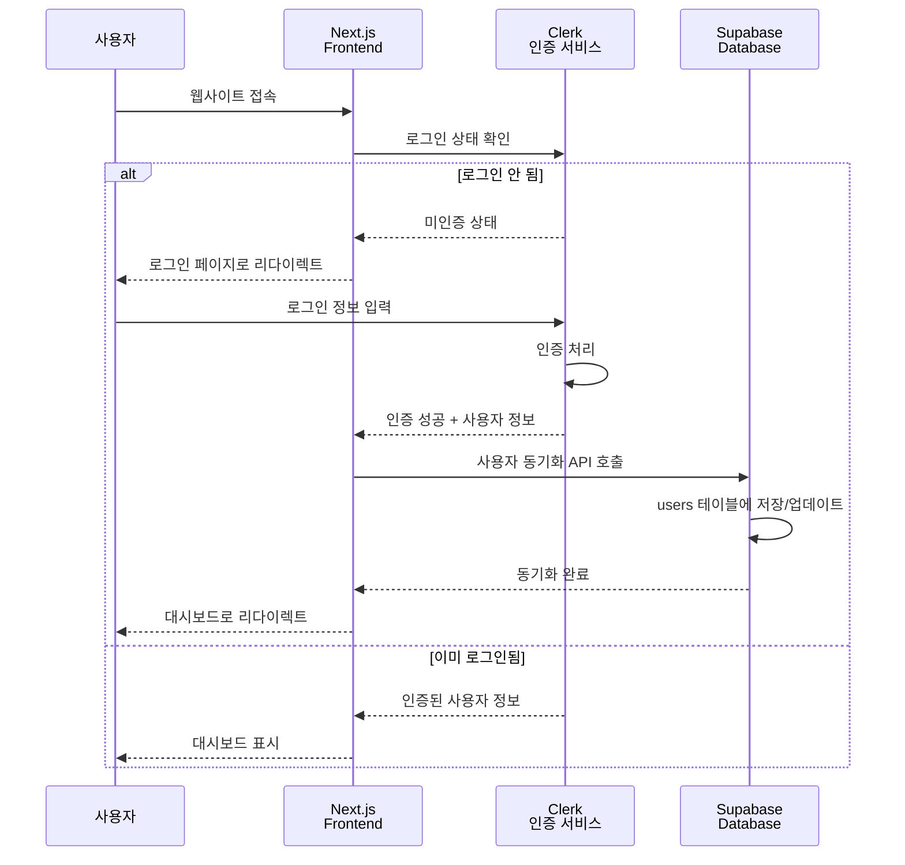
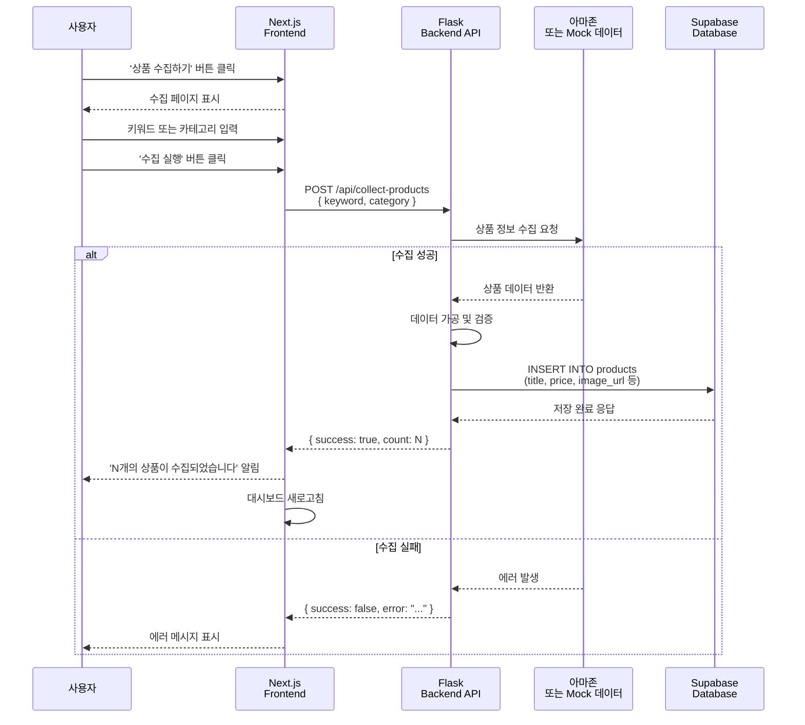
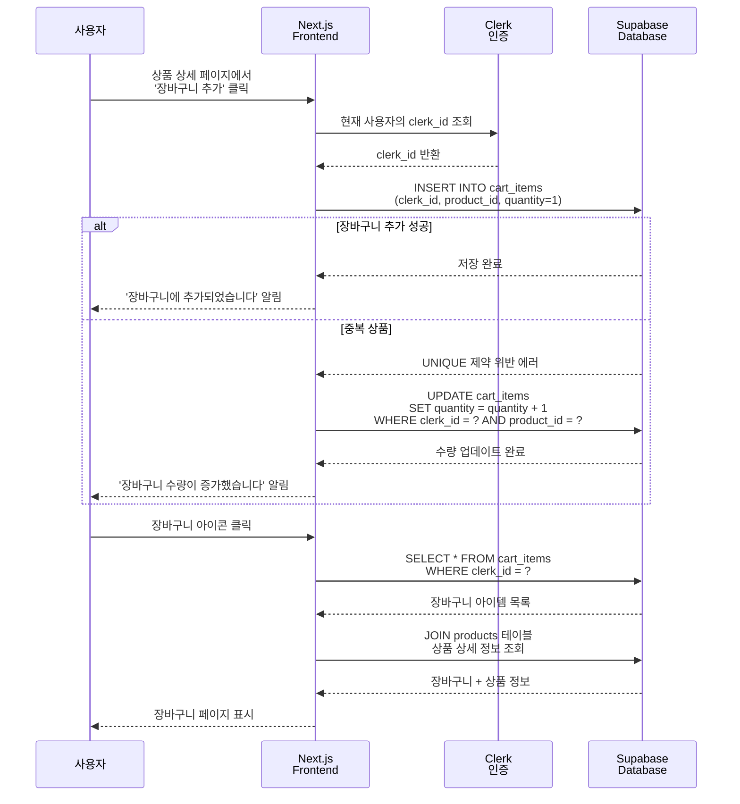
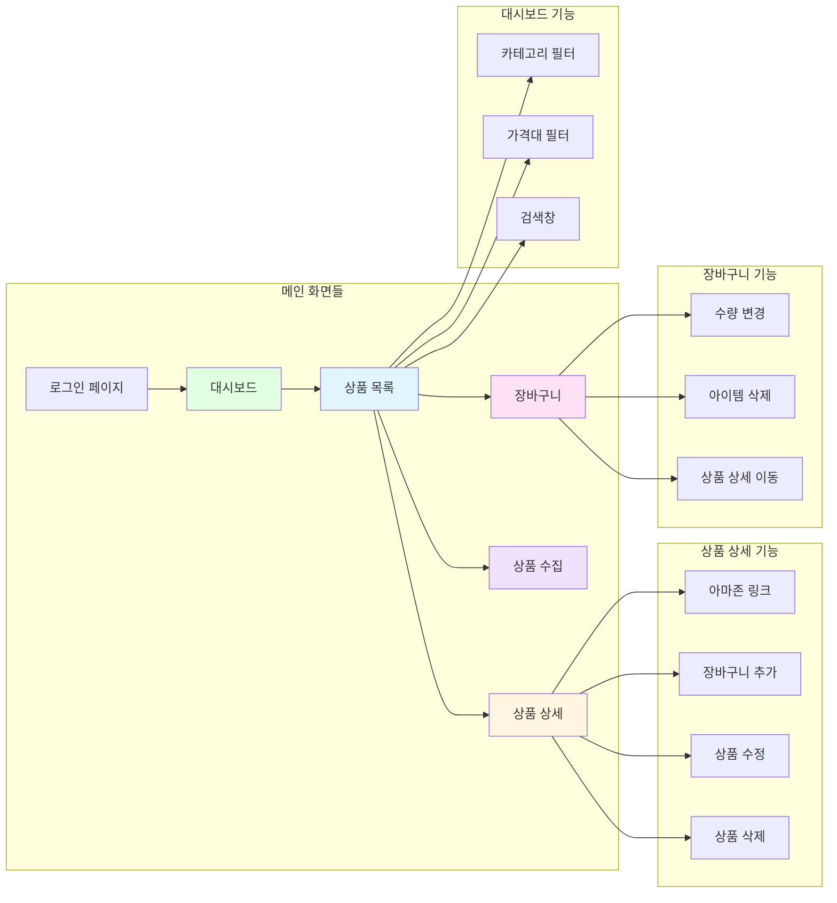

# 🎭 AutoList 유저 플로우 다이어그램

본 문서는 AutoList 아마존 상품 수집 서비스의 사용자 여정을 시각화한 것입니다.

## 📊 전체 유저 플로우



## 🔐 인증 플로우 상세



## 🛒 상품 수집 플로우 상세



## 🛍️ 장바구니 플로우 상세



## 📱 주요 화면 플로우



## 🎯 주요 사용 시나리오

### 시나리오 1: 신규 상품 수집 및 확인

```
1. 사용자 로그인 (Clerk)
   ↓
2. 대시보드 진입
   ↓
3. '상품 수집하기' 버튼 클릭
   ↓
4. 키워드 입력 (예: "wireless earbuds")
   ↓
5. Flask API 호출 → 아마존 수집 → Supabase 저장
   ↓
6. 수집 완료 알림
   ↓
7. 대시보드 새로고침 → 새 상품 표시
```

### 시나리오 2: 상품 필터링 및 장바구니 추가

```
1. 대시보드에서 'Electronics' 카테고리 필터 선택
   ↓
2. 필터링된 상품 목록 표시
   ↓
3. 특정 상품 카드 클릭 → 상품 상세 페이지
   ↓
4. '장바구니에 추가' 버튼 클릭
   ↓
5. cart_items 테이블에 저장 (clerk_id + product_id)
   ↓
6. 장바구니 아이콘 클릭 → 장바구니 페이지 확인
```

### 시나리오 3: 상품 관리 (수정/삭제)

```
1. 상품 상세 페이지에서 '수정' 버튼 클릭
   ↓
2. 상품 정보 수정 (가격, 설명 등)
   ↓
3. Supabase products 테이블 UPDATE
   ↓
4. 수정 완료 알림 → 상품 상세 페이지 새로고침
   
   또는
   
1. 상품 상세 페이지에서 '삭제' 버튼 클릭
   ↓
2. 삭제 확인 다이얼로그
   ↓
3. 확인 클릭 → Supabase products 테이블 DELETE
   ↓
4. 관련 cart_items도 CASCADE 삭제
   ↓
5. 상품 목록으로 돌아감
```

---

**작성일:** 2025-01-28  
**버전:** 1.0  
**작성자:** AutoList 개발팀

